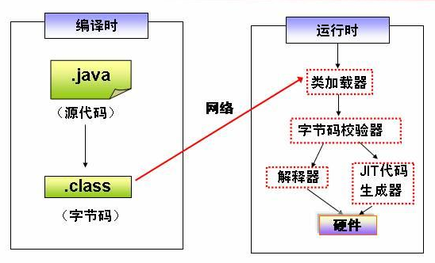
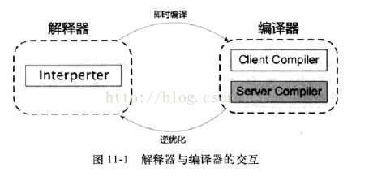

# JVM - 简介
## 1. JDK JRE JVM
### 1.1 JDK
> Java Development ToolKit(Java开发工具包)。   
> JDK是整个JAVA的核心，包括了Java运行环境(Java Runtime Envirnment)，一堆Java工具(javac/java/jdb等)和Java基础的类库(即Java API 包括rt.jar)  
> 常常用JDK来代指Java API，Java API是Java的应用程序接口，其实就是已经写好的一些共通的java Class，包括一些重要的语言结构以及基本图形，网络和文件I/O等等。  
> JDK包含JRE，JRE包含JVM
> Oracle JDK 收费，Open JDK 不收费

### 1.2 JRE
> Java Runtime Environmental(java运行时环境)。  
> 也就是我们说的JAVA平台，所有的Java程序都要在JRE下才能运行。包括JVM和JAVA核心类库和支持文件。与JDK相比，它不包含开发工具、编译器、调试器和其它工具。

### 1.3 JVM
> Java Virtual Machine(JAVA虚拟机)。JVM是JRE的一部分，它是一个虚构出来的计算机。  
> 是通过在实际的计算机上仿真模拟各种计算机功能来实现的。  
> JVM有自己完善的硬件架构，如处理器、堆栈、寄存器等，还具有相应的指令系统。 
> JVM 的主要工作是解释自己的指令集(即字节码)并映射到本地的CPU的指令集或OS的系统调用。  
> Java语言是跨平台运行的，其实就是不同的操作系统，使用不同的JVM映射规则，让其与操作系统无关，完成了跨平台性。  
> JVM 对上层的 Java 源文件是不关心的，它关注的只是由源文件生成的类文件(class file)，类文件的组成包括 JVM 指令集，符号表以及一些补助信息。  

## 2. 主流 JVM
java SE 主流JVM介绍

|      JVM   |    描述                          |           优点|                  缺点|
|  ----  | ----  |  ----  | ----  |
| Hotspot VM  | 主流JVM，可以称之为标准JVM。我们下载的JVM通常都是HotSpot JVM。JDK8后的jvm是融合了原HotSpot和JRockit(精华)之后的产物。 | 免费，主流| 若依赖Oracle/sun JDK的某些具体实现就要使用该JVM才行|
| J9 VM       | IBM 开发的一个高度模块化的jvm，号称世界上最快的java虚拟机，J9 VM命名为Open J9 |职责分离与模块化，支持AOT编译和更强大的class data sharing|收费，使用有限制，只能和IBM产品一起用|
| Zing VM     | Azul公司打造的，为需要大内存，高事务率，一致响应时间或者高持续吞吐量企业应用设计的与堆大小无关，可预测响应时间的JVM| 1. 更好的性能(支持 Zing 的 Falcon JIT 编译器是使用 LLVM 技术构建的，其可提供深入的优化。)   2. 无停顿执行(Azul 解决了Java 的垃圾回收问题。停止和应用程序超时、GC 停顿、停滞和抖动周旋)  3. 更快速启动(凭借 ReadyNow!® 技术，Java 应用程序启动速度快，且能保持高速运行) |收费|
| JRockit     | 以前的JVM(Hotspot, J9, JRockit称三大主流JVM)， Oracle收购Sun后淘汰了|||

### 2.1 HotSpot VM的Client模式和Server模式
Client模式: 适合桌面程序，通过快速初始哈，懒加载等优化减少启动时间，适应桌面程序特点。默认32位的hotspot都是client模式。  
Server模式: 适合服务器程序，预加载，并发等优化。默认64位的的都是server模式。  
共同点: 共用一套解释器。   

通过配置 %JAVA_HOME%/jre/lib/[i386/amd64]/jvm.cfg中-client， -server的位置来决定使用那种模式。  

## 3. JVM 执行过程
1> 编写java文件  
2> 使用前端编译器javac，编译java文件成为.class字节码文件  
3> 程序运行时，通过类加载器载入class字节码文件  
4> 对字节码文件进行校验  
5> 使用混合模式(解释器与编译器)，执行字节码文件    
6> 操作系统执行  

## 4. 编译
### 4.1 编译概念
动态编译(dynamic compilation)指的是在运行时进行编译。  
事前编译(ahead-of-time compilation，简称AOT)，也叫静态编译(static compilation)。  
即时编译 JIT (just in time compilation)，是动态编译(dynamic compilation，在运行时进行编译)的一种特例。  

### 4.2 编译器
最早java是由解释器(Interpreter)，将每个java指令转译为对等的微处理器指令，并根据转译后的指令先后次序依序执行，速度慢。  
输入的代码 -> [解释器 解释执行] -> 执行结果  
当虚拟机发现每个方法或者代码块的运行特别频繁时会把这些代码定位"热点代码"，为提高执行效率，在运行时，虚拟机将会把这些代码编译成与本地平台相关的机器码，并进行各种层次的优化，完成这个任务的编译器称为即时编译器，即JIT编译器。  
输入的代码 -> [ 编译器 编译 ] -> 编译后的代码 -> [ 执行 ] -> 执行结果  
**解释器与编译器**  
商用的Hotspot通常采用解释器和编译器共存的架构，当程序需要迅速启动和执行的时候，解释器可以首先发挥作用，省去编译的时间，立即执行。在程序运行后，随着时间的推移，编译器逐渐发挥作用，把越来越多的代码编译成本地代码之后，可以获取更高的执行效率。  
当程序运行环境中内存资源限制较大（如部分嵌入式系统中），可以使用解释器执行节约内存，反之可以使用编译执行来提升效率。此外，如果编译后出现"罕见陷阱"，可以通过逆优化退回到解释执行。  
  

#### 4.2.1 前端编译器
将java文件变成字节码文件通常通过javac工具。这个工具就是编译器，相对于其它编译器它处于编译前期，因此称之为前端编译器。
**编译过程**  
1. 词法、语法分析  
2. 填充符号表，对抽象的类或接口进行符号填充。等到类加载阶段，JVM 会将符号替换成具体的内存地址  
3. 注解处理，对注解进行分析，根据注解的作用将其还原成具体的指令集  
4. 分析与字节码生成  

常见的前端编译器有javac，Eclipse JDT 的增量式编译器(ECJ)  
#### 4.2.2 JIT 编译器
JIT编译器将所有的字节码变成机器码保存起来，所以它具有更高的运行速度。  
在HotSpot虚拟机内置了两个即时编译器，分别称为 Client Compiler 和 Server Compiler。这两种不同的编译器衍生出两种不同的编译模式，分别称之为：C1 编译模式，C2 编译模式。  

|编译模式|优点|缺点|
| ---- | ---- | ---- |
|C1 编译模式|编译速度较c2快|保守编译，进行简单，可靠的优化|
|C2 编译模式|编译质量好|激进编译，编译时间久，优化程度更高|

**编译模式**  
混合模式(Mixed Mode) 。即 C1 和 C2 两种模式混合起来使用，这是默认的运行模式。
解释模式(Interpreted Mode)。即所有代码都解释执行。
编译模式(Compiled Mode)。 此模式优先采用编译，但是无法编译时也会解释执行。

> 如果你想单独使用 C1 模式或 C2 模式，使用 -client 或 -server 打开即可。  
> 使用 -Xint 参数可以打开解释模式  
> 使用 -Xcomp 打开编译模式模式  
> 输入 java -version 可以查看jvm使用的编译模式  

#### 4.2.3 AOT 编译器
在程序执行前生成 Java 方法的本地代码，以便在程序运行时直接使用本地代码。  
但是 Java 语言本身的动态特性带来了额外的复杂性，影响了 Java 程序静态编译代码的质量。
例如 Java 语言中的动态类加载，因为 AOT 是在程序运行前编译的，所以无法获知这一信息，所以会导致一些问题的产生。

### 4.2.4 总结
+ 编译速度上，解释执行 > AOT 编译器 > JIT 编译器。  
+ 编译质量上，JIT 编译器 > AOT 编译器 > 解释执行。  

## 4. 其它
### 4.1 class 文件
> class: java文件经jvm编译后的字节码文件，xxx.class。  
### 4.2 dex 文件
> dex: java文件经dvm编译后的字节码文件，xxx.dex。dvm专门对移动操系统(android)的特性进行了优化，基于寄存器设计，指令集和jvm不同。  
> odex: optimize dex，对dex的优化。

## 5. 参照
[1. JVM种类](https://blog.csdn.net/lxlmycsdnfree/article/details/69286099)  
[2. Zing Vm](https://blog.csdn.net/21aspnet/article/details/88667880)  
[3. 编译器](https://www.cnblogs.com/chanshuyi/p/jvm_serial_04_from_source_code_to_machine_code.html)  

