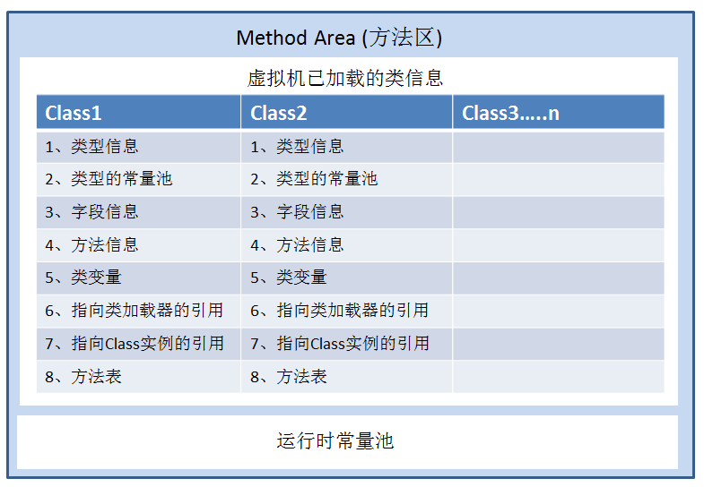

# JVM - 内存模型
## 1. JVM 内存模型
Java虚拟机(Java Virtual Machine，简称JVM)在执行Java程序的过程中会把它所管理的内存划分为若干个不同的数据区域。
这些区域都有各自的用途，以及创建和销毁的时间，有的区域随着虚拟机进程的启动而存在，有些区域则是依赖用户线程的启动和结束而建立和销毁。  
这些内存区域即JVM内存也被称之为运行时数据区(Runtime data area)。  

+ 蓝色区域为线程共享  
+ 白色区域为线程私有  

### 1.1 程序计数器
程序计数器(Program Counter Register)是一块较小的内存空间，记录当前线程执行程序的位置, 改变计数器的值来确定执行下一条指令, 比如循环、分支、方法跳转、异常处理, 线程恢复都是依赖程序计数器来完成。  
**特点**  
1. 线程私有，多线程是通过轮流切换并分配处理器执行时间的方式来实现的，任何一个确定的时刻只会执行一条线程中的指令，为了切换后能恢复正确位置，互不影响所以是线程私有的。  
2. 占用内存空间非常小，可以户略不计。  
3. 唯一一个java虚拟机规范中没有OOM情况的区域。  
4. 执行的若是java方法，记录虚拟机字节码指令地址，若是native，则计数器值为空(undefined)  

### 1.2 虚拟机栈
java虚拟机栈(java virtual Machine stacks)也叫栈内存，描述的是java方法执行的内存模型。  

**特点**  
1. 线程私有，随着线程的创建而创建，结束而释放，生命周期和线程一致。不存在垃圾回收。  
2. 方法执行时会创建一个栈帧，每个方法的执行对应着一个栈帧进栈出栈的过程。
4. 当线程请求的栈深度超过最大值 -> StackOverflowError (无限递归)。  
5. 当栈动态扩展而无法申请足够的内存时 -> OutOfMemoryError。  

> 局部变量(基本类型，对象引用)，方法的引用符号

### 1.2.1 栈帧(stack frame)
用于支持虚拟机进行方法调用和方法执行的数据结构。栈帧存储了方法的局部变量表、操作数栈、动态连接和方法返回地址等信息。每一个方法被调用直至执行完成的过程，就对应着一个栈帧在虚拟机栈中从入栈到出栈的过程。  

**特点**  
> 栈帧，用于存储局部变量表，操作栈，动态连接，方法出口等信息，局部变量表(基本类型，对象引用，返回值)在编译期间完成分配，运行期间不会改变局部变量表的大小。  

> 位于JVM虚拟机栈栈顶的元素才是有效的，即称为当前栈帧，与这个栈帧相关连的方法称为当前方法，定义这个方法的类叫做当前类。

**栈帧存储内容**  
1. 局部变量表: 输入参数，输出参数，方法内变量(基本类型变量，对象变量的引用)。局部变量表中的变量只在当前函数调用中有效，当函数调用结束后，随着函数栈帧的销毁，随之销毁。  
+ 基本类型: boolean、byte、char、short、int、float、long、double。(long，double占用两个局部变量空间(slot)，其余占用一个)  
+ 对象引用(reference类型): 根据不同的虚拟机实现，它可能是一个指向对象起始地址的引用指针，也可能指向一个代表对象的句柄或者其他与此对象相关的位置）  
+ 返回值(returnAddress): 指向了一条字节码指令的地址 
2. 操作数栈: 记录出栈，入栈的操作(后进先出)，执行引擎计算需要。  
- 与局部变量表一样，均以字长为单位的数组。不过局部变量表用的是索引，操作数栈是弹栈/压栈来完成一次数据的访问。操作数栈可理解为java虚拟机栈中的一个用于计算的临时数据存储区。  
- 每一个操作数栈都会拥有一个明确的栈深度用于存储数值，一个slot的数值使用一个栈深度，2个slot的数值需要两个栈深度，该深度在编译后即确定下来。
- 存储的数据与局部变量表一致含int、long、float、double、reference、returnType，操作数栈中byte、short、char压栈前(bipush)会被转为int。
- 操作数栈就是JVM执行引擎的一个工作区，当一个方法被调用的时候，一个新的栈帧也会随之被创建出来，但这个时候栈帧中的操作数栈却是空的，只有方法在执行的过程中，
才会有各种各样的字节码指令往操作数栈中执行入栈和出栈操作。比如在一个方法内部需要执行一个简单的加法运算时，首先需要从操作数栈中将需要执行运算的两个数值出栈，待运算执行完成后，再将运算结果入栈。  
- 数据运算的地方，大多数指令都在操作数栈弹栈运算，然后结果压栈。
- java虚拟机栈是方法调用和执行的空间，每个方法会封装成一个栈帧压入占中。其中里面的操作数栈用于进行运算，当前线程只有当前执行的方法才会在操作数栈中调用指令（可见java虚拟机栈的指令主要取于操作数栈）。  
3. 方法出口信息:  正常返回，异常返回，记录信息用于恢复它的上层方法执行状态。  
- 当前栈帧出栈  
- 恢复上层方法的局部变量表和操作数栈，把返回值(如果有的话)压入调用者的操作数栈中  
- 调整PC计数器的值指向方法调用指令后的下一条指令  
4. 动态连接: 栈帧中存储着指向运行时常量池(jdk7)该栈所属方法的引用符号，当在类加载或第一次使用时转化为直接引用时称之为静态解析，而在每次运行期间转化为直接引用即为动态连接。  
5. 附加信息: 虚拟机中增加一些规范中没有的描述信息到栈帧中，例如和调试相关的信息。  

  

**命令**
> 配置线程分配内存的大小，即虚拟机栈的大小  
> -Xss1m  jdk5.0后默认时1M  一个进程内的线程数是有限制的，不能无限生成，经验值在3000~5000左右。

### 1.3 本地方法栈
本地方法栈(Native Method Stack)，和虚拟机栈类似，区别在于它服务的时Native方法。

**特点**  
1. 和虚拟机栈差不多
2. 之服务于Native方法，当执行引擎执行时会加载native libraries。
3. 和JVM栈一样，这个区域也会抛出StackOverflowError和OutOfMemoryError异常。

### 1.4 方法区
方法区(Method Area)，别称永久代，非堆。用于存放已被加载的类信息、常量、静态变量、即时编译器编译后的代码等数据。  

  

**特点**  
1. 线程共享内存区域。  
2. 不需要连续的内存，可以动态扩展。
3. 当方法区无法满足内存分配需求时，会抛出OutOfMemoryError。  
4. 对这块区域进行垃圾回收的主要目标是对常量池的回收和对类的卸载，HotSpot 虚拟机把它当成永久代(Permanent Generation)来进行垃圾回收。 
+ 方法区和永久代，本质上两者并不等价。之所以称为永久代是因为HotSpot的垃圾收集器可以像管理Java堆一样管理这部分内存。   
5. JDK7已经开始转移到堆或者Native堆中，JDK8后彻底移除称之为元数据区(Metaspace)，元空间并不在虚拟机中，而是使用本地内存。因此，默认情况下，元空间的大小仅受本地内存限制。  
+ JDK8 是HotSpot VM 与 JRockit VM 的融合， 因为 JRockit 没有永久代所以这也是 PermGen 最终被移出一个原因。  

**存储**  
> 静态变量: 被static修饰的变量  
> 类信息: 版本、字段、方法、接口等描述信息  
> 常量池
>> 字面值常量: 文本字符串，被final修饰的类变量  
>> 符号引用量: 即时编译器编译后的代码(各种符号引用: 类的权限定名、字段名和属性、方法名和属性)等数据  

#### 1.4.1 常量池
class文件中除了包含类的版本、字段、方法、接口等描述信息外，还有一项信息就是常量池(constant pool table)，用于存放编译器生成的各种字面量(Literal)和符号引用(Symbolic References)。  
  

**命令**
> JDK 1.7通过 -XX:PermSize和-XX:MaxPermSize来调节  
> JDK8 使用-XX:MetaspaceSize和-XX:MaxMetaspaceSize 配置内存大小  

##### 1.4.1.1 静态常量池
在java文件编译成为class文件后，class文件中存储的即为class常量池又叫静态常量池。  
该常量池中通常存储一下信息:  
> 字面量: 文本字符串、被声明为final的常量值，基本数据类型的值等  
> 符号引用: 一组符号用来描述所引用的目标，符号可以是任何形式的字面量
> * 类和接口的全限定名  
> * 字段的名称和描述符  
> * 方法的名称和描述符  
> 描述符是描述字段或方法的类型的字符串。

**class字节码中的常量池**  
 

**字节码常量池类型**  

|序号 | 常量池中数据项类型  | 类型标志 |   类型描述 |
| ---- | ---- | ---- | ---- |
|1     |CONSTANT_Utf8       |1  |  UTF-8  编码的Unicode字符串  |
|2     |CONSTANT_Integer    |3  |  int 类型字面值  |
|3     |CONSTANT_Float      |4  |  float 类型字面值  |
|4     |CONSTANT_Long       |5  |  long 类型字面值  |
|5     |CONSTANT_Double     |6  |  double 类型字面值  |
|6     |CONSTANT_Class      |7  |  对一个类或接口的符号引用  |
|7     |CONSTANT_String     |8  |  String 类型字面值  |
|8     |CONSTANT_Fieldref   |9  |  对一个字段的符号引用  |
|9     |CONSTANT_Methodref  |10 |  对一个类中声明的方法的符号引用  |
|10    |CONSTANT_InterfaceMethodref  |11|  对一个接口中声明的方法的符号引用  |
|11    |CONSTANT_NameAndType         |12|  对一个字段 或 方法的部分符号引用  |

##### 1.4.1.2 运行时常量池
运行时常量池(Runtime Constant Pool)，是方法区的一部分。
jvm虚拟机在将类装载到内存中后，jvm就会将class常量池中的内容转存到运行时常量池中，类在解析后将把符号引用替换成直接引用，常说的常量池，就是指运行时常量池。运行时常量池也是每个类都有一个。   

> 类和接口的全限定名常量 CONSTANT_Class_info 值 cp_info #63 <java/lang/StringBuilder>  符号  
> 对应#63位置的引用常量 CONSTANT_Utf8_info 值为 java/lang/StringBuilder   符号  
> 运行时将会把 java/lang/StringBuilder 符号替换成 实际内存的地址  

##### 1.4.1.3 常量池关系
  

#### 1.4.2 字符串常量池
类加载完成，经过验证准备阶段之后，String 类型将在字符串常量池中创建对象。数据结构是一个hash表，一个JVM中只有一份，全局的。  

字符串常量池:  
> JDK7之前，存储在运行时常量池即方法区中，此时hotspot对方法区的实现称之为永久代。  
> JDK7时，字符串常量池拿到了堆中，运行时常量池剩下的东西还在方法区, 也就是hotspot中的永久代。   
> JDK8后，hotspot移除了永久代用元空间(Metaspace)取而代之, 这时候字符串常量池还在堆, 运行时常量池还在方法区, 只不过方法区的实现从永久代变成了元空间(Metaspace)。  

使用字符串常量池的原因:   
> 节省内存空间: 常量池中所有相同的字符串常量被合并，只占用一个空间  
> 节省运行时间: 比较字符串时，==比equals()快。对于两个引用变量，只用==判断引用是否相等，也就可以判断实际值是否相等。  

> 动态生成常量: String类的intern()方法，将在string pool中寻找，若找到则直接返回引用，找不到创建之后存储在常量池中返回   

#### 1.4.3 基本类型常量池
java虚拟机缓存了Integer、Byte、Short、Character、Boolean包装类在-128~127(Character 0-127)之间的值，如果取值在这个范围内，
会从int常量池取出一个int并自动装箱成Integer，超出这个范围就会重新创建一个。  

#### 1.4.4 元空间
元空间(metaspace)，JDK8之后用来代替方法区，存储再本地内存。  
> MetaSpaceSize：初始化元空间大小，控制发生GC阈值  
> MaxMetaspaceSize ： 限制元空间大小上限，防止异常占用过多物理内存  

### 1.5 堆
堆(heap)，JVM中占用内存最大的一块区域。主要存储new关键字创建的对象实例和数组。

**特点** 
> 主要的数据存储区域，线程共享的  
> 主要的垃圾回收对象  
> 内存不足时将抛出OutOfMemoryError异常  

#### 1.5.1 堆内存的划分
  
1. 新生代（Young Generation）  
存储new关键字创建的新对象，默认eden:From Survivor:To Survivor=8:1:1  
1.1 Eden区  
eden即伊甸园，它占用的空间通常比survivor大。对象刚开始创建的时候就会存储在该区域。  
1.2 Survivor区。  
1.2.1 From Survivor  
实际上作为回收的一个交换区，用于对对象进行多次gc，当gc多次(临界值 15)还存活的对象将被放入年老代。  
1.2.2 To Survivor  
minor gc时会先将eden区和from survivor区的对象进行回收，存活的对象将复制到to survivor区中，然后交换From Survivor和To Survivor的角色。
2. 旧生代（Old Generation）  
也叫年老代，存储生命周期特别久或者大对象
3. 永久代  
jdk7之前对方法区的回收处理方式，jdk8之后用metaspace替换了  

**GC 顺序**  
1> 刚创建的对象将放入Eden区  
2> eden空间不足将进行gc， 第一次GC时，将扫描eden和From Survivor区域，将存活的对象复制到To Survivor ，然后交互From Survivor和To Survivor的角色。
 To Survivor存储gc后仍然存活的对象，交换后 -> From Survivor  
 From Survivor在gc时将存活的对象复制到了to Survivor，此时为空，交换后 -> From Survivor  
3> 重复2步骤，当一个对象被多次gc后仍然存活，那么将该对象放入年老代。  

#### 1.5.2 堆的配置参数
| 参数   |描述   |
| ---- | ---- |
|-Xms|堆内存初始大小|
|-Xmx(MaxHeapSize)  | 堆内存最大允许大小，一般不要大于物理内存的80% |
|-XX:NewSize(-Xns)  | 年轻代内存初始大小           |
|-XX:MaxNewSize(-Xmn)       | 年轻代内存最大允许大小，也可以缩写           |
|-XX:NewRatio       | 新生代和老年代的比值, 值为4 表示 新生代:老年代=1:4，即年轻代占堆的1/5 |
|-XX:SurvivorRatio=8       | 年轻代中Eden区与Survivor区的容量比例值，默认为8, 表示两个Survivor :eden=2:8，即一个Survivor占年轻代的1/10          |
|-XX:+HeapDumpOnOutOfMemoryError       | 内存溢出时，导出堆信息到文件          |
|-XX:+HeapDumpPath       |  堆Dump路径         |
|-XX:OnOutOfMemoryError       | 当发生OOM内存溢出时，执行一个脚本          |
|-XX:MaxTenuringThreshold=7       |表示如果在幸存区移动多少次没有被垃圾回收，进入老年代           |

### 1.6 直接内存
直接内存（Direct Memory）并不是虚拟机运行时数据区的一部分，也不是Java虚拟机规范中定义的内存区域，但是这部分内存也被频繁地使用，而且也可能导致OutOfMemoryError 异常出现。
在 JDK 1.4 中新加入了 NIO 类，引入了一种基于通道（Channel）与缓冲区（Buffer）的 I/O方式，它可以使用 Native 函数库直接分配堆外内存，然后通过一个存储在 Java 堆里的 DirectByteBuffer 对象作为这块内存的引用进行操作。这样能在一些场景中显著提高性能，因为避免了在Java 堆和 Native 堆中来回复制数据。

### 1.7 详细内存分布图
  

## 2. 常量池详细 
常量池是为了避免频繁的创建和销毁对象而影响系统性能，其实现了对象的共享。  

**双等号==的含义**
> 基本数据类型之间应用双等号，比较的是他们的数值。
> 复合数据类型(类)之间应用双等号，比较的是他们在内存中的存放地址。

## 2.1 String 常量池  
```java
public class StringConstTest {
    private static void demo1() {
        // 字面值方式创建字符串
        String str1 = "abc";  // 将在字符串常量池中寻找 "abc" 若没有则创建字符串对象 "abc" 并存储后将该对象的地址返回给变量
        String str2 = "abc";  // 若有直接从常量池中返回 "abc" 的地址
        System.out.println(str1 == str2); // 结果 true
    }
}
```

```java
public class StringConstTest {
    private static void demo2() {
        // 下面会直接生成 "ABCDEFG" 对象存储到字符串常量池中 "ABC"  "DEF"  "G" 均不会创建
        String str1 = "ABC" + "DEF" + "G";
        String str2 = "ABCDEFG";
        System.out.println(str1==str2); // true
    }
}
```

```java
public class StringConstTest {
    private static void demo3() {
        String str1 = "abc";  // 字符串常量池中将创建"abc"
        // 将在堆中new一个对象返回地址引用给str2，而new的这个对象中value[] 指向字符串常量池中的"abc"
        // 这里共创建了一个对象
        String str2 = new String("abc");
        // 字符串常量池中创建 "def"  堆中创建对象返回引用给str3 这里共创建了2个对象
        String str3 = new String("def");
        System.out.println(str1 == str2);  // false
    }
}
```

```java
public class StringConstTest {
    public static void demo4() {
        String str1 = "a";   // 保存在常量池中
        String str2 = "b";   // 保存在常量池中
        final String _str1 = "a";
        final String _str2 = "b";
        String str3 = str1 + str2;    // str1 str2 是变量 动态调用 生成新的对象
        String _str3 = _str1 + _str2;  // _str1 _str2 常量 编译时替换为 "a" + "b"了 所以结果保存在常量池了
        String str4 = "ab";  // 常量池已经有了 取出引用赋值
        System.out.println(_str1 == str1);   // true
        System.out.println(str3 == str4);    // false
        System.out.println(_str3 == str4);   // true
    }
}
```

```java
public class StringConstTest {
    public static void demo4() {
        String str1 = "a";   // 保存在常量池中
        String str2 = "b";   // 保存在常量池中
        final String _str1 = "a";
        final String _str2 = "b";
        String str3 = str1 + str2;    // str1 str2 是变量 动态调用 生成新的对象
        String _str3 = _str1 + _str2;  // _str1 _str2 常量 编译时替换为 "a" + "b"了 所以结果保存在常量池了
        String str4 = "ab";  // 常量池已经有了 取出引用赋值
        System.out.println(_str1 == str1);   // true
        System.out.println(str3 == str4);    // false
        System.out.println(_str3 == str4);   // true
    }
}
```

```java
public class StringConstTest {
    private static final String str1;
    private static final String str2;
    static {
        str1 = "1";
        str2 = "2";
    }
    public static void demo5() {
        String str = "12"; // 存储在常量池中
        // 静态变量在编译期不会执行 所以可以看作是变量 运行时 动态调用 生成新的对象
        String tmp = str1 + str2;
        System.out.println(str == tmp); // false
    }
}
```

```java
public class StringConstTest {
    public static void demo6() {
        String str = "abcdef";
        String str2 = "def";
        String str3 = "abc" + str2;  // str2变量 动态调用
        String str4 = "abc" + new String("def"); // 常量池和堆中的引用做 + 会动态调用

        System.out.println(str == str3);  // false
        System.out.println(str == str4);  // false
    }
}
```

```java
public class StringConstTest {
    public static void demo7() {
        String str = "abc"; // 放入常量池中
        // 现在常量池中找"abc" 找到的话直接返回引用地址给str1 没找到创建保存到常量池中 并返回引用地址
        // intern() 运行时动态常量创建
        String str1 = new String("abc").intern();
        System.out.println(str == str1); // true
    }
}
```

## 2.2 基本类型常量池  
```java
public class OtherConstTest {

    public static void main(String[] args) {
        int i = 101;       // 字面值
        Integer i1 = 101;  // 返回常量池中引用
        Integer i2 = 101;  // 返回常量池中引用
        Integer i3 = new Integer(101);  // 创建新对象
        System.out.println(i == i2);   // 自动拆箱 进行字面值比较
        System.out.println(i1 == i2);  // true
        System.out.println(i1 == i3);  // false

        int b = 128;        // 字面值
        Integer b1 = 128;        // 自动装箱创建新对象
        Integer b2 = 128;        // 自动装箱创建新对象
        System.out.println(b == b1);    // 自动拆箱 进行字面值比较
        System.out.println(b1 == b2);   // false
    }
}
```

## 4. jclasslib.jar 工具使用
### 4.1 下载安装 jclasslib.jar
自行下载并安装，该工具可以查看.class文件的具体字节码结构，和 javap -v 效果相同  
或者在idea中安装jclasslib插件也行  
### 4.2 工具的使用
```java
public class JvmDemo01 {

    public int demo1(Object obj) {
        byte b = 1;
        short s = 2;
        int i = 1;
        long lo = 64L;
        boolean flag = true;
        float f = 3.14f;
        double dou = 3.14159265;
        char c = 'A';
        for (int j = i; j < lo; j++) {
            // 无
        }
        return i + b;
    }


    public static void main(String[] args) {
        System.out.println("jvm 局部变量表");
    }
}
```
#### 4.2.1 局部变量占用槽
  
#### 4.2.2 局部变量信息查看
  
#### 4.2.3 操作数栈的运算
* iconst: 压入栈中，int类型在-1~5  
* bipush: 压入栈中，int类型在-128~127  
* sipush: 压入栈中，int类型在-32768~32767  
* ldc: 压入栈中，int类型在-2147483648~2147483647  
* ldc2_w: 压入栈中，long double
* iload: 将一个局部变量加载到操纵栈  
* istore，fstore，dstore: 将一个数值从操作数栈存储到局部变量表  
* i2l: 类型转换 int -> long   
* lcmp: 比较两个long的大小  

```jvm
 0 iconst_1    # byte b = 1 将1压入操作数栈中
 1 istore_2    # 弹出操作数栈栈顶元素，将 1 保存到局部变量表索引为2的位置
 2 iconst_2    # short s = 2 将2压入操作数栈中
 3 istore_3    # 弹出操作数栈栈顶元素，将 2 保存到局部变量表索引为3的位置
 4 iconst_1    # int i = 1 将1压入操作数栈中
 5 istore 4    # 弹出操作数栈栈顶元素，将 1 保存到局部变量表索引为4的位置
 7 ldc2_w #2 <64>    # long lo = 64L 将64压入操作数栈中
10 lstore 5    # 弹出操作数栈栈顶元素，将 64 保存到局部变量表索引为5的位置
12 iconst_1    # boolean flag = true 将true压入操作数栈中
13 istore 7    # 弹出操作数栈栈顶元素，将 1 保存到局部变量表索引为7的位置  long占用两个slot
15 ldc #4 <3.14>    # float f = 3.14f 将3.14压入操作数栈中
17 fstore 8         # 弹出操作数栈栈顶元素，将 3.14 保存到局部变量表索引为8的位置
19 ldc2_w #5 <3.14159265>   # 同上
22 dstore 9         # 同上
24 bipush 65        # 同上
26 istore 11        # 同上
28 iload 4          # 从局部变量表中复制索引为4的数值(即 int i = 1)到操作数栈中
30 istore 12        # 弹出操作数栈栈顶元素，将复制的这个值保存到局部变量表索引为12的位置 其实就是j  
32 iload 12         # 从局部变量表中复制索引为12的数值(即 1)到操作数栈中
34 i2l              # 类型转换 int -> long
35 lload 5          # 从局部变量表中复制索引为5的数值(即 long lo = 64L)到操作数栈中
37 lcmp             # 比较两个long类型的大小
38 ifge 47 (+9)     # 如果大于0 即如果为真继续 否则跳转到47 也就是前进9步
41 iinc 12 by 1     # int类型变量增加指定的值 这里 j++
44 goto 32 (-12)    # 跳转到32步 也就是后退12步
47 iload 4          # 载入局部变量索引为4的数值 int i = 1
49 iload_2          # 载入局部变量索引为4的数值 byte b = 1
50 iadd             # 进行加法计算  入栈的i b 将出栈进行 + 运算 之后将结果入栈 即弹栈运算，然后结果压栈
51 ireturn          # 栈顶元素出栈返回
```

## 附录参照  
1. [指令详细上](https://blog.csdn.net/hudashi/article/details/7062781)  
2. [指令详细下](https://hongyoutian.blog.csdn.net/article/details/7062675)  
3. [虚拟机栈](https://zhuanlan.zhihu.com/p/45354152)
4. [方法区](https://www.jianshu.com/p/59f98076b382)
5. [常量池](https://blog.csdn.net/xiaojin21cen/article/details/105300521)
6. [jvm内存结构](https://blog.csdn.net/rongtaoup/article/details/89142396)
