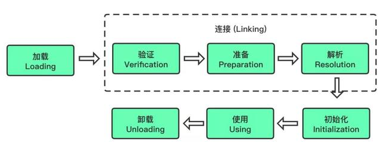
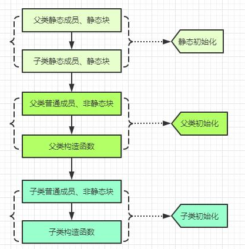
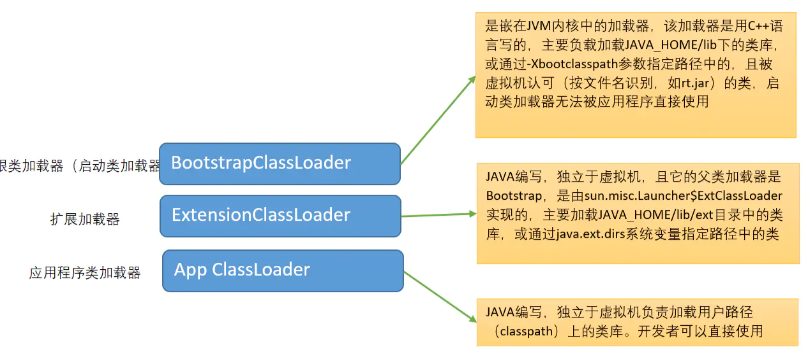
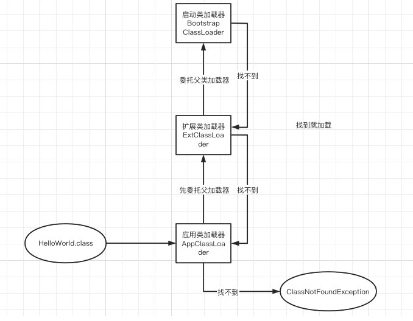

# JVM - 类加载
我们编写的java文件经过javac编译成class字节码文件，然而当项目启动时，这些class文件是如何装载到jvm中的？直到运行时又经历了些什么？
这些从class文件装载进jvm到程序运行之间的过程即JVM的类加载机制。  

总结一句话，类加载机制就是java虚拟机将类的描述文件class加载到内存，并对数据进行校验，转换解析和初始化，最终形成可以被虚拟机直接使用的java类型。  

那么你该知道了我们编写代码时的 Class 对象是谁了吧？ 嗯，它就是class字节码文件经过加载后在jvm中的一种存在形式，
也叫类元信息，通常通过它我们可以获取它的类路径，名称，加载器，构造方法，字段，方法等相关的类信息。  

如下图，JVM的类加载流程   

  

由上面的图片知道，一个class文件的生命周期是，加载->连接(连接又分为验证，准备，解析)->初始化->使用->卸载  
以上顺序都只是说开始的顺序，实际过程中是交叉的混合式进行的，加载过程中可能就已经开始验证了。  
下面详细描述下各个生命周期都发生了什么  
## 1. 加载（Loading）
听名字，加载就是把类放入jvm中，没错就是这样的丫。加载主要的作用就是找到相应的class文件，并将该class文件放入到jvm内存中中进行下一步。  
### 1.1 类加载器
如何找到这些相应的class字节码文件呢，这里就是通过类加载器(classloader)类进行的，ClassLoader只负责class文件的加载。至于它是否可以运行，则由Execution Engine决定。  
常说的双亲委派模式也就是类加载器得工作机制。 详细描述在下面。
### 1.2 类加载流程
>1. 类加载器通过类的全限定名找到获取定义此类的二进制字节流，将其搬运到jvm中。  
>2. jvm将字节流中类信息存放到方法区中，class中的静态常量池转换成运行时常量池。  
>3. 在堆内存中生成一个代表这个类的java.lang.Class对象，作为方法区这个类的各种数据访问入口。  
### 1.3 加载方式
+ 从本地系统中直接加载
+ 通过网络获取，典型场景：Web Applet
+ 从zip压缩文件中读取，成为日后jar、war格式的基础
+ 运行时计算生成，使用最多的是：动态代理技术
+ 由其他文件生成，比如 JSP 应用
+ 从专有数据库提取.class 文件，比较少见
+ 从加密文件中获取，典型的防 Class 文件被反编译的保护措施

## 2. 连接 （Linking）
### 2.1 验证 （Verify）
确保class文件的字节流中包含的信息符合当前虚拟机的要求, 并且不会危害虚拟机自身的安全。  
**四种验证**  
- 文件格式验证: 主要验证字节流是否符合Class文件格式规范，并且能被当前的虚拟机加载处理。例如：主，次版本号是否在当前虚拟机处理的范围之内。常量池中是否有不被支持的常量类型。指向常量的中的索引值是否存在不存在的常量或不符合类型的常量。
- 元数据验证: 对字节码描述的信息进行语义的分析，分析是否符合java的语言语法的规范。
- 字节码验证: 最重要的验证环节，分析数据流和控制，确定语义是合法的，符合逻辑的。主要的针对元数据验证后对方法体的验证。保证类方法在运行时不会有危害出现。
- 符号引用验证: 主要是针对符号引用转换为直接引用的时候，是会延伸到第三解析阶段，主要去确定访问类型等涉及到引用的情况，主要是要保证引用一定会被访问到，不会出现类等无法访问的问题。  

可以使用 -Xverify:none 来关闭大部分的类验证措施, 以缩短虚拟机加载的时间。  
### 2.2 准备 (Prepare)
为静态变量分配内存空间，并设置默认值，还可能会给一些数据结构分配内存(例: 方法表)提高程序性能。  
注意噢，这里说的是设置默认值，那么  
```java
public final static int i = 1; // 由于是final的编译阶段就会分配2，常量
public static j = 1; // 准备阶段会分配内存，设置默认值，默认值是啥 当然是0了 所以 j 此时是0，初始化时才会被设置为1  
```
| 类型 | 默认值 |
| ---- | ---- |
| int | 0 |
| long | 0L |
| short | 0 |
| char | '\u0000' |
| byte | (byte)0 |
| boolean | false |
| float | 0.0 |
| double | 0.0 |
| reference(引用) | null |

### 2.3 解析 （Resolve）
解析动作主要针对类或接口、字段、类方法、接口方法、方法类型等符号引用。
对应常量池中的CONSTANT_Class_info、CONSTANT_Fieldref_info、CONSTANT_Methodref_info等，
在类型的常量池中寻找类、接口、字段和方法的符号引用，把这些符号引用替换成直接引用(直接指向目标的指针、相对偏移量或一个间接定位到目标的句柄)。  
这个阶段可以被推迟到初始化之后(，解析操作往往会伴随着JVM在执行完初始化之后再执行)，当程序运行的过程中真正使用某个符号引用的时候 再去解析它。  

## 3. 初始化（Initialization）
初始化阶段就是执行类构造器方法<clinit>()的过程并且
为类(静态)变量赋予正确的初始值。 一个正确的初始值是通过类变量初始化语句或者静态初始化块给出的。

### 3.1 类的初始化时机
类的初始化时机，即类在什么时候进行初始化。分为主动使用和被动使用，主动使用才会触发类的初始化。  
#### 3.1.2 主动使用触发初始化
1. 创建类的实例、访问某个类或接口的静态变量，或者对该静态变量赋值、调用类的静态方法(即遇到new、getstatic、putstatic、invokestatic这四条字节码指令时)  
2. 反射，调用Java API中的某些反射方法   
3. 初始化时父类未初始化, 先触发父类的初始化（而一个接口在初始化时，并不要求其父接口全部都完成了初始化）  
4. Java虚拟机启动时被标明为启动类的类，即含有main()方法的类启动时 
5. JDK7 开始提供的动态语言支持：java.lang.invoke.MethodHandle实例的解析结果，REF_getStatic、REF_putStatic、REF_invokeStatic句柄对应的类没有初始化，则初始化  
#### 3.1.2 被动使用不触发初始化
除了主动使用之外的都是被动使用。  
1. 通过子类引用父类的静态字段, 不会导致子类初始化。
2. 通过数组定义来引用类, 不会触发此类的初始化。MyClass[] cs = new MyClass[10];
3. 常量在编译阶段会存入调用类的常量池中, 本质上并没有直接引用到定义常量的类, 因此不会触发定义常量的类的初始化。  
```java
class SuperClass {
    protected static int num = 10;

    static {
        num = 11;
    }
}

class SubClass extends SuperClass {
    static {
        num = 12;
    }
}

public class JvmInitialization {

    public static void main(String[] args) {
        // 父类初始化 子类没有初始化
        System.out.println(SubClass.num);
    }
}

```
> 输出: 11  
### 3.2 初始化顺序

  

```java
class JvmParent {

    public static int num1 = 10;

    static { System.out.println("父类的静态成员初始化块 1 ！"); }

    { System.out.println("父类的构造函数初始化块!"); }

    static {
        num1 = 20;
        System.out.println("父类的静态成员初始化块 2 ！");
        num2 = 20;
        // System.out.println(num2); 非法的前向引用，可以赋值，不可调用
    }

    public static int num2 = 10;

    public JvmParent() {
        System.out.println("父类的构造函数");
    }
}

public class JvmClassInitialization extends JvmParent {

    static { System.out.println("子类的静态成员初始化块 1 ！"); }

    { System.out.println("子类的构造函数初始化块!"); }

    static { System.out.println("子类的静态成员初始化块 2 ！");  }

    public JvmClassInitialization() {
        // 这里其实默认是有super()的
        System.out.println("子类的构造函数");
        System.out.println("num1 : " + num1);
        System.out.println("num2 : " + num2);
    }

    public static void main(String[] args) {
        new JvmClassInitialization();
    }
}

```
> 输出:
> 父类的静态成员初始化块 1 ！  
> 父类的静态成员初始化块 2 ！  
> 子类的静态成员初始化块 1 ！  
> 子类的静态成员初始化块 2 ！  
> 父类的构造函数初始化块!  
> 父类的构造函数  
> 子类的构造函数初始化块!  
> 子类的构造函数  
> num1 : 20  
> num2 : 10  

### 3.3 初始化案例
所有的类均只会发生一次初始化  
```java
public class Alibaba {
    public static int k = 0;
    public static Alibaba t1 = new Alibaba("t1");
    public static Alibaba t2 = new Alibaba("t2");
    public static int i = print("i");
    public static int n = 99;
    private int a = 0;
    public int j = print("j");
    {
        print("构造块");
    }
    static {
        print("静态块");
    }

    public Alibaba(String str) {
        System.out.println((++k) + ":" + str + "   i=" + i + "    n=" + n);
        ++i;
        ++n;
    }

    public static int print(String str) {
        System.out.println((++k) + ":" + str + "   i=" + i + "    n=" + n);
        ++n;
        return ++i;
    }

    public static void main(String args[]) {
        Alibaba t = new Alibaba("init");
    }
}
```
> 结果:
> 当看见main方法那么已经满足主动初始化条件了, 在 "准备" 阶段各个static字段已经申请空间并赋予默认值了  
> 初始化时进入initialization阶段，在 initialization 阶段，先对 static 属性赋值，然后在对非 static 的属性赋值  
> 在对t1进行赋值时，由于static这些字段正处于初始话字段，不会在再次初始化，所以直接忽略进行非static字段赋值  
> 结果为:  
> 1:j i=0 n=0  
> 2:构造块 i=1 n=1  
> 3:t1 i=2 n=2  
> 4:j i=3 n=3  
> 5:构造块 i=4 n=4  
> 6:t2 i=5 n=5  
> 7:i i=6 n=6  
> 8:静态块 i=7 n=99  
> 9:j i=8 n=100  
> 10:构造块 i=9 n=101  
> 11:init i=10 n=102  

## 4. 类加载器
类加载器的作用是找到class文件并载入jvm内存。保证同一个类(根据类的全限定名即唯一标志)不会重复加载，

  

**类加载机制**  
> 1. 全盘负责: 即加载某个class文件时，该class所依赖和引用的其它class也会由该类加载器负责载入。 除非显示使用另外一个加载器来载入。  
> 2. 双亲委派。
> 3. 缓存机制: 加载过的class将被缓存，若为缓存那么创建Class对象并缓存，所以修改后的class必须重启才能生效。  

### 4.1 类加载器种类
#### 4.1.1 启动类加载器
启动类加载器(引导类加载器，Bootstrap ClassLoader)，加载器使用C/C++语言实现，嵌套在jvm内部(jvm的一部分)，主要用来加载java的核心库。
**加载核心类库有:**  
+ JAVA_HOME/jre/lib/rt.jar，resource.jar等  
+ sun.boot.class.path路径下的内容  
+ -Xbootclasspath 参数指定路径  

出于安全考虑Boostrap 启动类加载器只加载名为java、Javax、sun等开头的类  

```java
// 打印启动类加载器加载了那些内容
public static void main(String[] args) {
    URL[] urls = sun.misc.Launcher.getBootstrapClassPath().getURLs();
    for(URL url : urls){
        System.out.println(url.toExternalForm());
    }
}
```
#### 4.1.2 扩展类加载器
扩展类加载器(Extensions classLoader)，java语言编写，由sun.misc.Launcher$ExtClassLoader实现，派生于 ClassLoader，父类加载器为启动类加载器。  
**加载类库有:**  
+ -Djava.ext.dir指定位路径中的类库  
+ 从java.ext.dirs系统属性所指定的目录中加载类库  
+ 从JDK的安装目录的jre/lib/ext 子目录(扩展目录)下加载类库， 如果用户创建的JAR 放在此目录下，也会自动由扩展类加载器加载。  

```java
//ExtClassLoader类中获取路径的代码
private static File[] getExtDirs() {
    //加载<JAVA_HOME>/lib/ext目录中的类库
    String s = System.getProperty("java.ext.dirs");
    File[] dirs;
    if (s != null) {
        // StringTokenizer 用于分隔字符串
        StringTokenizer st = new StringTokenizer(s, File.pathSeparator);
        int count = st.countTokens();
        dirs = new File[count];
        for (int i = 0; i < count; i++) {
            dirs[i] = new File(st.nextToken());
        }
    } else {
        dirs = new File[0];
    }
    return dirs;
}
```
#### 4.1.3 应用程序类加载器
应用程序类加载器，也叫系统类加载器(AppClassLoader)，java语言编写，由 sun.misc.Lanucher$AppClassLoader 实现，派生于 ClassLoader，父类加载器为null。  
**加载类库有:**  
+ 环境变量classpath路径下的类库  
+ java -classpath或-D java.class.path 指定路径下的类库  

该类加载是程序中默认的类加载器，一般来说，Java应用的类都是由它来完成加载的，通过 ClassLoader#getSystemClassLoader()方法可以获取到该类加载器。

#### 4.1.4 自定义类加载器
除了上面的三种加载器之外，继承自ClassLoader的加载器都可以称之为自定义加载器。对于同一个类来说，不同的加载器来加载，那么这两个类就不相等。  

**为什么要自定义加载器** 
+ 隔离加载类，修改类加载的方式，可以达到部分隔离，部分共享的效果，tomcat的自定义加载器就是这样的目的。  
+ 扩展加载源(可以从数据库、云端等指定来源加载类)  
+ 防止源码泄露(Java代码容易被反编译，如果加密后，自定义加载器加载类的时候就可以先解密，再加载)  

**用户实现自定义加载器步骤**  
1. 开发人员可以通过继承抽象类 java.lang.ClassLoader 类的方式，实现自己的类加载器，以满足一些特殊的需求
2. 在JDK1.2之前，在自定义类加载器时，总会去继承ClassLoader类并重写loadClass()方法，从而实现自定义的类加载类，但是JDK1.2之后已经不建议用户去覆盖loadClass()方式，而是建议把自定义的类加载逻辑写在findClass()方法中
3. 编写自定义类加载器时，如果没有太过于复杂的需求，可以直接继承URLClassLoader类，这样就可以避免自己去编写findClass()方法及其获取字节码流的方式，使自定义类加载器编写更加简洁

**加载器API**

| 方法 | 描述 |
| ---- | ---- |
| loadClass(String) | ClassLoader 自己实现的一个方法，具有双亲委托机制，父类中找不到后，内部调用findClass() |
| findClass() | 自定义加载器推荐重写的方法，用来寻找要加载的class文件 |
| defineClass() | 将byte字节流解析为jvm能识别的Class对象，常常配合findClass()使用 |
| resolveClass() | 可以使用类的Class对象创建完成也同时被解析 |

```java
public class MyClassLoader extends ClassLoader {

    @Override
    public Class<?> loadClass(String name) throws ClassNotFoundException {
        try {
            System.out.println(name);
            InputStream is = getClass().getResourceAsStream(name);
            if(is == null) {
                return super.loadClass(name);
            }
            byte[] b = new byte[is.available()];
            is.read(b);
            return defineClass(name, b, 0, b.length);
        } catch (Exception e) {
            e.printStackTrace();
            throw new ClassNotFoundException ();
        }
    }

    public static void main(String[] args) throws Exception {
        ClassLoader loader = new MyClassLoader();
        Object obj = loader.loadClass("learn.jvm.demo.Math").newInstance();
        System.out.println(obj);
    }
}

final class Math {
    public void out() {
        System.out.println("Math out");
    }
}
```
> 结果: 
> learn.jvm.demo.Math  
> learn.jvm.demo.Math@548c4f57  

不能自己写以java.开头的类，不然会出现 SecurityException。  

### 4.2 双亲委派模式

  

双亲委派模式即，当一个类加载器收到了加载请求，它先把这个请求委派给父类加载器去完成，每一个层次的类加载器都是如此。 当父加载器无法完成这个加载请求时, 子类加载器才会尝试自己去加载。  

**优势**  
+ 避免类的重复加载，JVM中区分不同类，不仅仅是根据类名，相同的class文件被不同的ClassLoader加载就属于两个不同的类(比如，Java中的Object类，无论哪一个类加载器要加载这个类，最终都是委派给处于模型最顶端的启动类加载器进行加载，如果不采用双亲委派模型，由各个类加载器自己去加载的话，系统中会存在多种不同的Object类)  
+ 保护程序安全(即沙箱安全机制)，防止核心API被随意篡改，避免用户自己编写的类动态替换 Java的一些核心类，比如我们自定义类：java.lang.String  

#### 4.2.1 破坏双亲委派模型
可以知道我们自定义类加载器，寻找class时可以不去调用父类加载器(重写loadClass()方法)，即破坏了双亲委派模型，重写findClass()方法不会破坏双亲委派。
即不破坏可以提供额外的加载路径，破坏也能达到一些其它目的。    
那么为什么要破坏这个模型呢？  
+ 利用破坏双亲委派来实现代码热替换(每次修改类文件，不需要重启服务)。因为一个Class只能被一个ClassLoader加载一次，
否则会报java.lang.LinkageError。当我们想要实现代码热部署时，可以每次都new一个自定义的ClassLoader来加载新的Class文件。JSP的实现动态修改就是使用此特性实现。  
+ 进行类的层次划分(隔离)。如Tomcat中使用了自定ClassLoader，使得多个项目可以加载不同版本的第三方类库，也可以共享相同版本的类库。  
+ java提供了很多服务提供者接口(Service Provider Interface, SPI)， 允许第三方为这些接口提供实现。常见的SPI有JDBC, JCE, JNDI, JAXP 和JBI等。
由于接口是在核心类库由启动类加载器加载，而实现类确实由系统类加载，因为启动类加载器是无法委托系统类加载器的，所以就会存在这种缺陷，这里就引入了线程上下文类加载器，
破坏了"双亲委派模型"，可以在执行线程中抛弃双亲委派加载链模式，使程序可以逆向使用类加载器。  

## 附录
1. [类加载器](https://blog.csdn.net/javazejian/article/details/73413292)  
2. [tomcat类加载](https://www.cnblogs.com/aspirant/p/8991830.html)
3. [上下文类加载器](https://www.cnblogs.com/aspirant/p/8991830.html)

