# JVM - 垃圾回收
## 什么是垃圾？
生活中对我们而言没有继续使用价值的东西，我们称之为垃圾，是垃圾就要被处理掉。那么在java中，不再使用的对象被定义为垃圾。可是jvm不是人，它没有人的思绪，那么它怎么知道什么是垃圾呢？  
算法赋予了程序"思维"的能力，如何识别垃圾，jvm使用可达性分析算法来解决的。  
**引用计数法**  
jvm并没有使用这个算法，它是给对象添加引用计数器，每当对象被引用时+1，不再引用时-1，计数为0时即认为垃圾。然而它没有解决循环依赖的问题。  

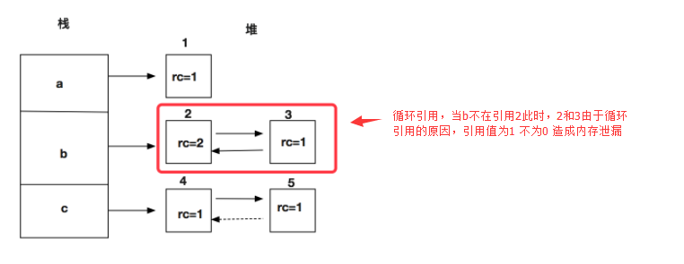  

**可达性分析算法**  
jvm使用的算法，通过一系列称为"GC Roots"的对象作为起始点，从这些节点开始向下搜索，搜索走过的路径称为"引用链"，当一个对象到 GC Roots 没有任何的引用链相连时(从 GC Roots 到这个对象不可达)时，证明此对象是垃圾。  
可作为GC Roots对象的有: 
> 虚拟机栈/本地方法栈(栈中的本地变量表)中引入的对象。  
> 方法区的类变量或者常量引用的对象。  

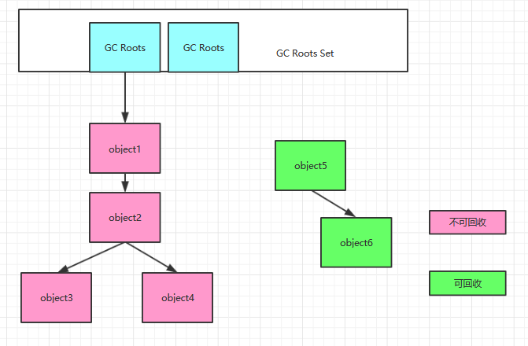 

### 引用
> __强引用:__ new 出来的对象基本都是强引用，只要引用在，则不会被视为垃圾。  
> __软引用:__ 常用于缓存，用来描述有用但不是必须的对象，当系统内存不足时会进行回收，SoftReference类来实现软引用。  
> __弱引用:__ 非必须对象，只要发生了垃圾回收，那么它就会被回收。WeakReference类来实现弱引用。WeakHashMap就使用了其原理。  
> __虚引用:__ 和没有引用一样, 任何时候都能被回收, 主要用来跟踪对象垃圾回收的活动, 和ReferenceQueue联合使用。  

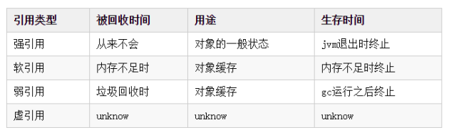 

## 那些区域有垃圾？
我们知道jvm的运行时数据区有pc计数器，虚拟机栈，本地方法栈，方法区，堆。  
首先pc计数器排除，虚拟机栈(本地方法栈)同线程的生命周期，并且局部变量表编译后大小固定，所以不需要回收。那么回收的对象就是方法区和堆了，它们也是线程共享的。  

### 堆区垃圾定义
引用不可达的对象，被定义为垃圾。

### 方法区垃圾定义
方法区中废弃的常量和无用的类被定义为垃圾。  
常量: 当一个常量没有对其的引用时会被移除常量池。 
类: 所有的实例被回收，该类对应的Class对象没有其它任何地方被引用(包括反射)，加载改类的类加载器被回收。

特别注意的是，当回收类时，满足以上条件，仅仅是"被允许"回收。关于是否要回收，HotSpot虚拟机提供了-Xnoclassgc参数控制。  
频繁自定义类的场景中(大量使用反射、动态代理、CGLib等字节码框架…)，通常需要Java虚拟机具备类型卸载的能力(自定义类加载器，加载器指向null，被该加载器加载的类，即被卸载)，以保证不会对方法区造成过大的内存压力。 

## 怎么处理这些垃圾？
什么时候会被定义成为垃圾，当然是发生gc的时候，什么时候会gc，gc分为两种:  
Minor Gc: 对新生代就行回收，因为新生代朝生夕死的，回收频繁，每当新生代内存不足时触发GC。  
Full GC (Major GC): 对整个堆进行回收(新生代和年老代)，触发的原因有年老代或者持久代被写满，程序System.gc()调用，堆区域分配策略发生变动。  
当发生gc的时候就会分析对象是否是垃圾，若是垃圾也不是立即回收，而是"缓刑"，首先就行第一次标记，并赛选，赛选条件是对象是否已经执行了finalize()方法
或者finalize()方法是否被重写。这里finalize()方法是Object的方法，默认类似于C++的析构函数，用来清理善后的，由jvm进行垃圾回收时调用。以上条件对象未执行
finalize()方法并且重写了finalize()方法，那么对象被定义为有必要执行finalize()方法的。这些对象会被放入一个F-Queue的队列中，之后由一个虚拟机自动创建的
优先级低的Finalizer线程去执行它触发finalize()方法。在该finalize()方法中若该对象被重新引用赋值，可发生对象的自救。值得注意的是对一个对象而言，finalize()方法
只会执行一次，也就是只能自救一次。再之后gc会对这个F-Queue进行二次标记，自救的复活，没自救的移除"缓刑"区，判定死亡。
其它情况即赛选条件为已执行了finalize()方法或者未重写finalize()方法时，说明该对象死亡了，进行立即回收。  

> 总结，在gc的时候进行垃圾回收，回收时通过二次标记，确定死亡的才彻底回收。回收时最多最少会执行一次finalize()方法。finalize()方法可以自救一次。  

在jvm中垃圾回收并不是说定义为垃圾之后，直接释放内存就完事了，其实还要进行一些其它的工作，比如整理，比如分类。这也是为啥要划分新生代，年老代的原因。这些区域的划分
可以使得生命周期短暂的对象在新生代中被快速回收，生命周期长的挪到年老代中专门管理，不同的区域采用不同的回收规则，加快回收速度。因地制宜，因材施教，因区域的不同而采用不回收规则。
整理，回收的对象是不连续的，回收后释放的空间也就是不连续的，不连续的空间利用率极低，所以要进行整理呀。这样大的对象才能放下，不然一堆不连续的小空间是什么鬼，利用率太低了吧。  

> 总结，回收不是单纯的释放内存就完事了，还要进行空间的整理，对象挪移等，这些是通过垃圾回收算法来实现的。

### 标记清除算法
标记: 通过根节点(Gc Roots)，标记所以从根节点开始的对象。  
清除: 对未被标记的对象回收。  

优点: 适合年老代，存活对象较多的情况。  
缺点: 容易产生空间碎片，大对象容易提前触发GC，需要扫描整个空间两次且，速度慢(标记，清除)。  

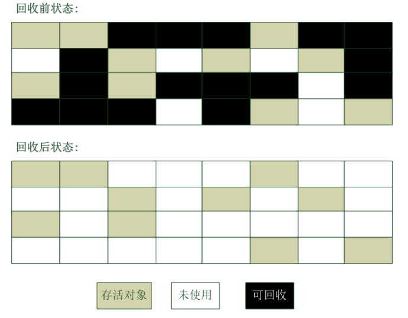  

### 复制算法
将内存空间分成两部分，每次都是使用其中的一部分，当发生gc时将使用区域存活的对象复制到另一块上面，修改指向，然后把使用区域全部清空。  

优点: 适合新生代，存活对象少的情况，效率高。不需要考虑内存碎片情况。  
缺点: 空间利用率低，毕竟需要分出来一部分。不适合存活对象多的情况，这项复制耗时间。  

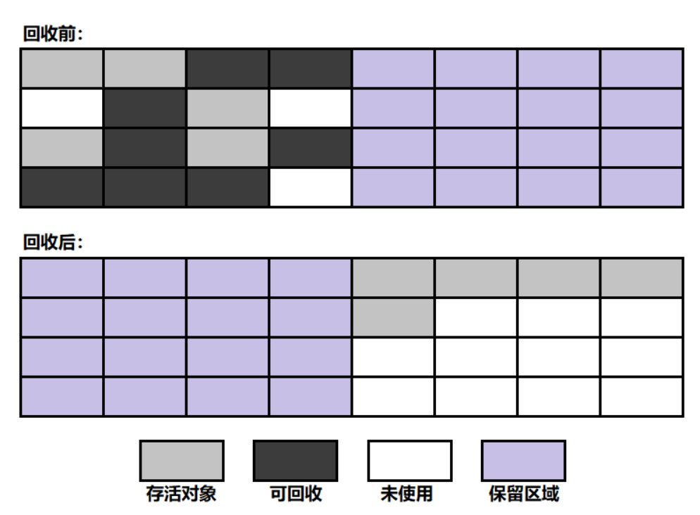  

现在的jvm大多都采用这种算法来回收新生代。新生代中对象存活时间短，存活久的对象也将会被挪到年老代中，所以复制算法极为合适。  
可以知道新生代分为一个较大的伊甸区(eden)和两个较小的幸存区(survivor)。
新生代复制算法回收步骤:  
1) 创建对象时，都将在Eden区申请内存空间。  
2) 进行minor GC，将Eden区和From区中存活的对象复制到To区域，修改对象指向，清空Eden和From区。在复制的时候，若是大对象那么放置到年老代中，
若是存活代数大于阈值(默认15)，也就是该对象多次回收依然存活，那么也放入年老代中。  
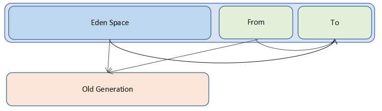  
3) 交换From区和To区的角色，那么此时的To(原来的From)仍为干净空间，继续1->3，每进行一次回收，存活的对象标记会增加1，当多次回收仍然存活会放入年老代。  
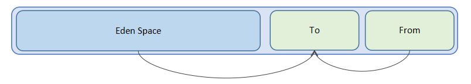  
4) 若年老代被写满的话会进行full gc，该gc比较耗时。  

### 标记整理算法
其实就是标记清除算法的进阶版本，标记阶段仍然一样，只是清除阶段会将存活的对象向一端移动即整理，然后清理掉端边界以外的内存。  

优点: 适合年老代，存活对象多的情况，效率高。  
缺点: 在移动时必须全程占用用户应用，不适合存活对象少的情况。  

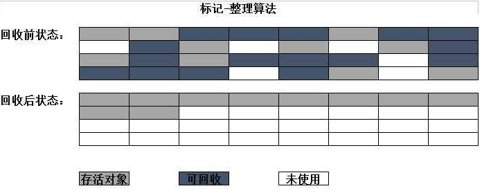  

### 分代收集算法
即将堆划分为新生代，年老代，不同的空间采用不同的垃圾收集算法。  

## 垃圾回收器
回收算法是实现理论，垃圾回收器是垃圾回收的实践者。  

**并行和并发概念** 
串行(Serial): 同一个时间点只能进行一个动作。  
并行(Parallel): 同一个时间段多种动作可以同时进行。如边敲代码边听歌。
并发(Concurrent): 多种动作可以同时进行，也可以交替进行。如喝口水，吃口饭。

### Serial 垃圾回收器
> 和用户线程串行  
> 特点: 新生代，单线程，复制算法，用户线程达到安全点时，所有线程暂停执行，Serial以单线程进行垃圾回收，回收完毕，用户线程继续。  
> 适用场景: Client模式(桌面应用)，单核服务器。  
> -XX:+UserSerialGC 来选择 Serial 作为新生代收集器。  
> 简单高效，由于没有线程交互的开销，专心垃圾收集自然可以获得最高的单线程效率。  

### Serial Old 垃圾回收器
> 和用户线程串行  
> 特点: 年老代，单线程，标记整理算法，用户线程达到安全点时，所有线程暂停执行，Serial以单线程进行垃圾回收，回收完毕，用户线程继续。  
> 适用场景: Client 模式(桌面应用)，单核服务器，与 Parallel Scavenge 收集器搭配，作为 CMS 收集器的后备预案。  
> 简单高效，由于没有线程交互的开销，专心垃圾收集自然可以获得最高的单线程效率。  

**Serial和Serial Old**  
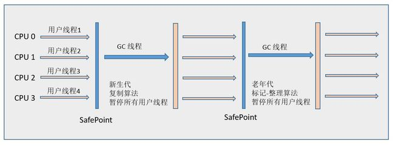  

### ParNew 垃圾回收器
> 和用户线程串行，多个垃圾回收线程并行  
> 特点: 新生代，多线程，复制算法，用户线程达到安全点时，所有线程暂停执行，ParNew以多线程并行进行垃圾回收，回收完毕，用户线程继续。  
> 适用场景: 多核服务器(单核服务器还不如用Serial)，与 CMS 收集器搭配使用。  
> -XX:+UseParNewGC 来选择 ParNew 作为新生代收集器。 -XX:ParallelGCThreads设置垃圾收集的线程数(默认和核数相当)。  

### Parallel Scavenge 垃圾回收器
> 和用户线程串行，回收线程并行  
> 特点: 新生代，多线程，复制算法，和ParNew不同之处在于回收停顿时间可以控制，即吞吐量可控(吞吐量=程序执行时间/(程序执行时间+垃圾回收时间))。  
> 适用场景: 注重吞吐量，高效利用 CPU，需要高效运算且不需要太多交互。  
> jdk7、jdk8 默认使用 Parallel Scavenge 作为新生代收集器。  

> -XX:+UseParallelGC 选择 Parallel Scavenge 作为新生代收集器
> -XX:MaxGCPauseMillis 单位毫秒，设置收集器尽可能在多长时间内完成内存回收  
> -XX:GCTimeRatio 精确控制吞吐量，默认99  
> -XX:+UseAdaptiveSizePolicy 打开该参数jvm会根据前两个参数调节Eden和Survivor的比列。  

### Parallel Old 垃圾回收器
> 和用户线程串行，回收线程并行  
> 特点: 年老代，多线程，标记整理算法，即吞吐量可控。  
> 适用场景: 与Parallel Scavenge 收集器搭配使用，注重吞吐量。  
> -XX:+UseParallelOldGC  选择 Parallel Old 作为年老代收集器。  
> jdk7、jdk8 默认使用 Parallel Old 作为年老代收集器。  

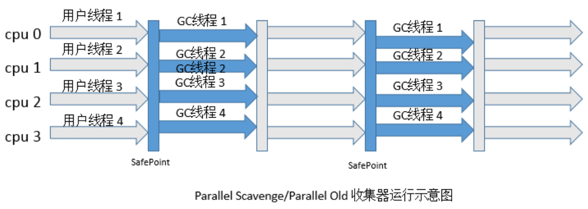  

### CMS 垃圾回收器
> 和用户线程并发  
> 特点: 年老代，多线程，标记清除算法，默认收集线程数为(CPU数量+3)/4，CPU数量少于2个的时候，不建议使用。  
> 适用场景: 多核服务器，。  
> 多核效率高。以最短用户线程停顿时间著称。  

> -XX:+UserConMarkSweepGC: 来选择 CMS 作为年老代收集器。  
> -XX:+UseCMSCompactAtFullCollection: Full GC后，进行一次碎片整理；整理过程是独占的，会引起停顿时间变长  
> -XX:+CMSFullGCsBeforeCompaction:  设置进行几次Full GC后，进行一次碎片整理  
> -XX:+ParallelCMSThreads:  设定CMS的线程数量(一般情况约等于可用CPU数量)   

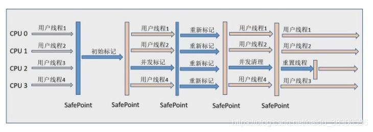  
① 初始标记：标记一下 GC Roots 能直接关联到的对象，速度较快。  
② 并发标记：进行 GC Roots Tracing，标记出全部的垃圾对象，耗时较长。  
③ 重新标记：修正并发标记阶段引用户程序继续运行而导致变化的对象的标记记录，耗时较短。  
④ 并发清除：用标记-清除算法清除垃圾对象，耗时较长。  

### 收集器之间的配对
连线的收集器才能配对  
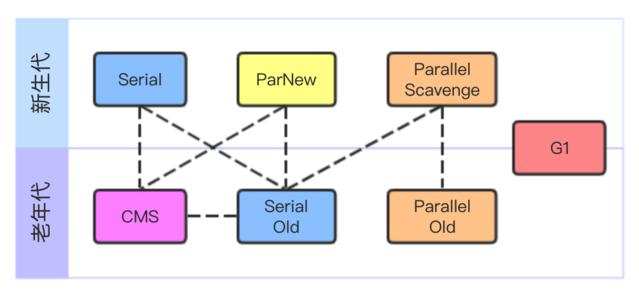  

### G1 收集器  
> jdk9默认垃圾收集器，收集范围是整个堆，保留分代概念    
> 维持高回收率，可预测停顿，提供软实时中断特性(回收时间超过设置时间会停止回收，恢复程序)，减少停顿。它并不是最快的Parallel是目前最快的。  
> 并行与并发，多个线程并行回收，且和用户应用程序并发运行。  
> 空间整合，整体使用的是标记整理算法，局部使用的是复制算法。分配大对象不会无法得到连续空间而触发GC。  
> 当新生代占用达到一定的比例的时候，开始触发收集。回收年老代也会有短暂的停顿。  
> -XX:+UseG1GC 启用G1垃圾收集器  

什么时候使用G1比较好  
1) JVM内存大，多核
2) 活动对象占据了超过50%的Java堆空间。  
3) 对象分配率或者提升率波动明显。  
4) 不希望有长时间的垃圾收集暂停时间(超过0.5秒或1秒)。  

**G1描述**  
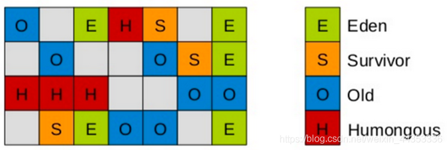  
在G1中，堆(head)被分隔成2的次幂个大小相等的区域(Region)，每个Region都有一个关联的Remembered(RS)，RS的数据结构是hashtable，里面的数据是card table，
当Region中数据发生变化时，会反应到一个或者多个card上。RS通过card来得知Region中内存的使用情况。  
相比于CMS来说G1，虽然有划分分代概念，但其实面向每个区域的。另外G1进行了整理，且停顿时间可调整。  

**收集步骤**
① 初始标记阶段  
② 并发标记阶段  
③ 最终标记阶段  
④ 筛选回收阶段  
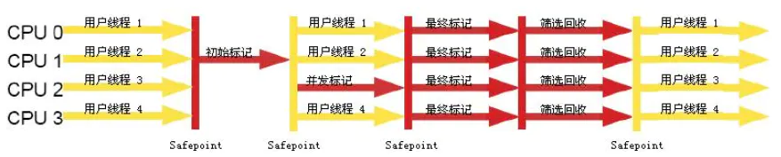  

## 附录
1. [垃圾回收](https://www.jianshu.com/p/426cf52d45ed)

