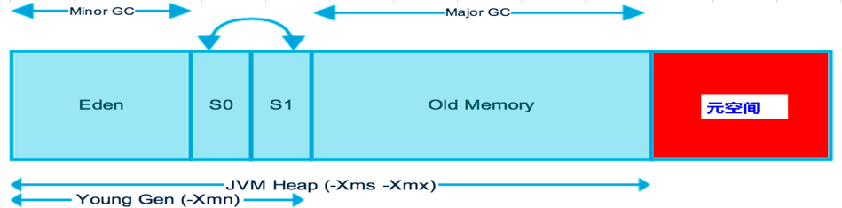

# JVM - 性能优化
## 1. JVM 配置参数  
### 1.1 堆内存配置  
  

| 配置参数 | 简介| 默认值 | 推荐值 | 举例 | 其它 |
| ---- | ---- | ---- | ---- | ---- | ---- |
| -Xmx | 堆最大内存 | - | - | -Xmx3550m | - |
| -Xms | 堆最小内存 | - | - | -Xms3550m | 最大和最小相等 可以避免Gc后的内存重新分配 |
| -Xmn | 新生代内存 | - | 整个堆的3/8 | -Xmn2g | - |
| -Xss | 线程栈大小 | 1M | - | -Xss128k | - |
| -XX:NewRatio | 新生代与年老代的比值 | - | - | -XX:NewRatio=4 | 4 的话，新生代占堆的1/5，年老呆占堆的4/5 |
| -XX:SurvivorRatio | 幸存区与伊甸区的比值 | - | - | -XX:SurvivorRatio=4 | 4 的话，eden占新生代的4/6，s0=s1=1/6 |
| -XX:MaxPermSize | 持久代大小 | 64M | - | -XX:MaxPermSize=16m | - |
| -XX:MaxTenuringThreshold | 垃圾年龄 | 15 |  |  |  |

### 1.2 垃圾回收统计信息

| 配置参数 | 描述 |
| ---- | ---- |
| -XX:+PrintGC |  |
| -XX:+PrintGCDetails |  |
| -XX:+PrintGCTimeStamps |
| -Xloggc:filename |  |

### 1.3 垃圾回收器使用

> 查看JVM配置: java -XX:+PrintCommandLineFlags -version  
> 查看GC情况:  java -XX:+PrintGCDetails -version  

| 配置参数 | 描述 | 其它 |
| ---- | ---- | ---- |
| -XX:+UseSerialGC | 启用串联收集 Serial和Serial Old，古老的垃圾收集器 | 单线程，单核，前端vm推荐 |
| -XX:+UseParNewGC | 启用ParNew收集器(Serial的单线程回收变成多线程回收)，JDK5.0以上 | 多核 |
| -XX:+UseParallelGC | 启用Parallel收集器(ParNew的升级版)，DK7,8 默认的新生代垃圾收集器 | 要求回收时间可控(吞吐量) |
| -XX:+UseParallelOldGC | 启用Parallel Old收集器(Parallel的年老代版本)，JDK6开始支持，JDK7,8 默认的年老代垃圾收集器 | 要求回收时间可控(吞吐量) |
| -XX:+UserConMarkSweepGC | 启用CMS收集器 | 低停顿 |
| -XX:+UseG1GC | 启用C1收集器，JDK9默认使用 | 大内存堆，低停顿 |

**Parallel其它参数配置**  

| 配置参数 | 描述 |
| ---- | ---- |
| -XX:ParallelGCThreads | 并行收集线程数，推荐与处理器数相当 |
| -XX:MaxGCPauseMillis | 单位毫秒，设置收集器尽可能在多长时间内完成内存回收 |
| -XX:GCTimeRatio | 精确控制吞吐量，默认99 |
| -XX:+UseAdaptiveSizePolicy | 打开该参数jvm会根据前两个参数调节Eden和Survivor的比列 |

**CMS其它参数配置**  

| 配置参数 | 描述 |
| ---- | ---- |
| -XX:+UseCMSCompactAtFullCollection | Full GC后，进行一次碎片整理，整理过程是独占的，会引起停顿时间变长 |
| -XX:+CMSFullGCsBeforeCompaction |  设置进行几次Full GC后，进行一次碎片整理 |
| -XX:+ParallelCMSThreads | 设定CMS的线程数量(一般情况约等于可用CPU数量) |

**举例**  
> java -Xmx3800m -Xms3800m -Xmn2g -Xss128k -XX:+UseParallelGC -XX:+UseParallelOldGC -XX:ParallelGCThreads=4 XX:MaxGCPauseMillis=100 -XX:+UseAdaptiveSizePolicy  
> 新生代使用Parallel收集器，年老代使用Parallel old收集器，并行收集线程数4，收集用户线程暂停时间100毫秒，且jvm自动调整Eden和survivor以满足配置要求。  

